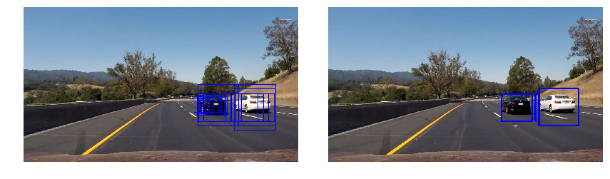

# Udacity Self Driving Car Nanondegree

## Project 2: Vehicle Detection and Tracking

The complete solution and code to this project can be found in the single jupyter notebook file,
[VehicleDetection.ipynb](VehicleDetection.ipynb)

The final video can be viewed here:

<a href="http://www.youtube.com/watch?feature=player_embedded&v=H0eOPcHmcSk" target="_blank">
  
</a>


The goals / steps of this project are the following:

* Perform a Histogram of Oriented Gradients (HOG) feature extraction on a labeled training set of images and train a classifier Linear SVM classifier
* Optionally, you can also apply a color transform and append binned color features, as well as histograms of color, to your HOG feature vector. 
* Note: for those first two steps don't forget to normalize your features and randomize a selection for training and testing.
* Implement a sliding-window technique and use your trained classifier to search for vehicles in images.
* Run your pipeline on a video stream (start with the test_video.mp4 and later implement on full project_video.mp4) and create a heat map of recurring detections frame by frame to reject outliers and follow detected vehicles.
* Estimate a bounding box for vehicles detected.

## Histogram of Oriented Gradients (HOG)

I extracted HOG features using the following parameters.  This can be found in the functions
`get_hog_features` and `_calculate_hog` in the Jupyter Notebook:

- `color_space = 'YCrCb'`
- `orient = 9`
- `pix_per_cell = 8`
- `cell_per_block = 2`
- `hog_channel = 0`

I found these parameters by trial an errors.  I found that the color space really didn't make a big
difference when looking at grayscale vs. other single channels from different color spaces such as
RGB, YUV and YCrCb.  I looked at all of the various color spaces and didn't see a large difference,
again, looking at a single channel.
Below is a visualization of the HOG features from a single image:


Taking a look at a distribution of the hog features showed comparable results between gray and
YCrCb...this distribution was similar across various color spaces.


## SVM classifier

I used the `sklearn` `LinearSVC` for training on test images.  I experimented with various
permutations of features, including:

- HOG 
- HOG + spatial
- HOG + color
- HOG + spatial + color

At the end of all this, I was getting the best results with *all* features being used, HOG +
spatial + color.

The function `extract_features` is the entry-point for extracting features for a list of images.  A
helper function named `single_img_features` can be used for testing on a single image.

To train the SVM I have a single function called `train`. This function uses all of the global
variables defined for the various feature extraction:

```
color_space = 'YCrCb'
orient = 9
pix_per_cell = 8
cell_per_block = 2
hog_channel = 0
spatial_size = (32, 32)
hist_bins = 16
spatial_feat = True
hist_feat = True
hog_feat = True
```

Feature extraction took the majority of the time and training was fairly quick.  I would routinely
get above 97% accuracy:

```
(17760, 4884)
Using: 9 orientations 8 pixels per cell and 2 cells per block
Feature vector length: 4884
19.03 Seconds to train SVC...
Test Accuracy of SVC =  0.9789
```

## Sliding Window Search

There is a single function named `slide_window` in cell two of the notebook which does the sliding
window search. I decided upon five different categories of searches corresponding to different
slices of the image:

- `really_close`
- `close`
- `medium`
- `far`
- `really_far`

Each category consists of different parameters for the area of the image to scan, overlap and size
of the box.  These can all be viewed in the cell after the definition of the `slide_window`
function.

I performed all of this imperially by:

1. taking a best guess
2. testing on sub-sampled video
3. making changes to the window parameters
4. back to 2

I found this to be a very critical part of the pipeline.  Too many small areas would make the video
extremely jumpy.  Without enough overlap there would not be enough "hit" to identify the cars at
time.  Ultimately I ended up scanning with a high amount of overlap for the boxes in the mid-range
size.

Below is a visualization of the final scanning regions.  Boxes are drawn with random colors so it's
easier to differentiate the boxes.


This is a larger view of the `really_far` scanning region:


In the pipeline I used a heatmap where every pixel contained within a bounding box was incremented
by 1.  Because I'm scanning with multiple sized boxes and because there is overlap a car would get
"hit" by a box multiple times, typically.  From time to time there would be a false-positive
in a random location. The heatmap would produce an image which would get brighter as there were
more "hits".

I applied a threshold of `3` to keep any regions meaning there had to be at least three
"hits" on an area in order for it to be kept.

Once the thresholding was applied I used the `label` function from `scipy` to determine the final areas
of interest and the bounding boxes for the final boxes.

Here are a few frames and their corresponding heatmaps. In all images below the first column
displays all of the detected car images or "hits" for a particular box during the sliding window:


Here is the output of `scipy.ndimage.measurements.label()` on the integrated heatmap:


Below are some examples of the final results...all of the boxes are drawn in the first column
while the second column consists of the "final" boxes after heatmap and thresholding:




## Discussion

I found that it was critical to get the right number and size of scanning windows. I went through
various permutations and had choppy videos at the beginning due to too many small windows.  After a
few iterations I found better results by doing many overlapping scans in the mid-range of the box sizes.

As seen in the example sliding windows, I scan from the left to the right which ends up stopping
short of the right edge of the frame. This results in the cars not being detected until they are in
clear view.  It could help to add some additional scanning from the right to the left.

